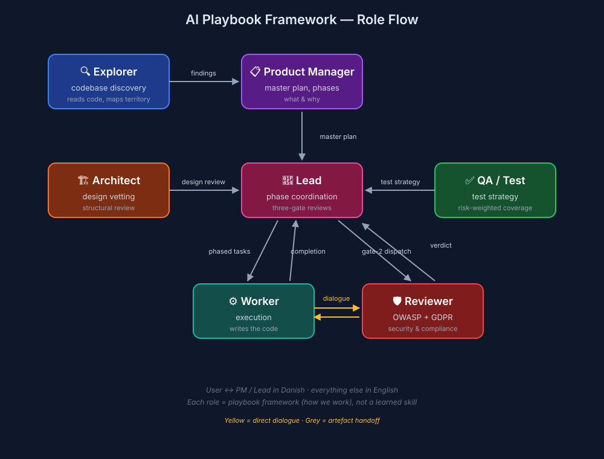

# Mythical Playbooks

A framework for HOW (and why) AI agents work together on multi-step technical projects.

This repository is not a collection of skills. It is not a set of technical specifications. It is a set of **playbooks** — direct, opinionated system prompts that define agent roles, the discipline each role exercises, and the protocols between them. Load a playbook into a fresh agent session and the agent has a role, a posture, and a set of rules for handing work off to other roles.

## Stability and forking

These playbooks are a **living system, not a frozen spec**. They are tuned continuously against real multi-agent operation, and releases may change role behaviour — prompts, procedures, gates, defaults — without notice when something is found to work better. What stays deliberately stable is **intent at the boundaries**: a role's purpose and its must/must-not lines in `ROLES.md` change rarely, explicitly, and never as a side effect of tuning.

If you depend on today's exact behaviour, **fork this repository and maintain your own copy** — that is the supported way to pin it. Tracking this repo directly means accepting behavioural drift in exchange for the improvements.

## Roles

The framework decomposes a multi-step technical project into **role contracts** for delivery, review, observation, apex strategy, and sparring: **four pipeline roles** (PM → lead → worker, plus the one-off explorer), **four read-only review roles** (architect, QA, reviewer, designer) that the pipeline dispatches when the phase surface warrants it, **Ops** for read-only production health observation, and the operational **CTO** apex (strategic; the team's apex under rhythm D, below). It also defines **Devil**, an operator-only sparring role outside the authority chain, optionally bound to a project read-only for grounded challenge. Each role has a single base playbook plus optional Claude Code and Codex overlays, and a deliberately narrow remit. The roles protect each other's boundaries.

One **strategic role stub** (**SPM**) is defined but not yet operational — SPM-class concerns route to the operator. The **CTO** is operational (v0.2) and is the team's apex under authority rhythm D: the only role that talks to the operator, answers the team immediately (no agent waits on the operator), buffers the reserved surface to the operator (except an all-green merge-to-main, which it authorizes itself — green-path delegation), and relays replies back. See `ROLES.md` for the consolidated role catalogue, `cto-agent.md` (operational + overlays) and `spm-agent.md` (stub) for the role contracts.

Roles that face the human address them as **"operator"**; a deployment may supply the operator's preferred name at session start, in which case agents use that name instead.

Devil is not part of PM → Lead → Worker, the review gates, Ops, or CTO apex substitution. No agent dispatches or addresses it. The operator may spawn it unbound (`spawn(devil)`) or bound to a project read-only (`spawn(devil, --project <name>)`); the runtime injects the professional operator profile at spawn, not in the role file.



### Pipeline roles

```
User
  ↕ (user's language)

┌─ explorer-agent ────────────────────────────────────────────────┐
│ Reads existing codebases. Produces navigation artefacts.        │
│ One-off, read-only. Skipped for greenfield work.                │
└─────────────────────────────────────────────────────────────────┘
  ↓ artefacts at <repo>/docs/architecture/

┌─ pm-agent ──────────────────────────────────────────────────────┐
│ Scopes new work. Premise-challenges. Locks problem before       │
│ solution. Emits a PRD + master plan + initial PM-to-lead        │
│ handoff (PRD first; the plan cites its FR-n/NFR-n IDs).         │
└─────────────────────────────────────────────────────────────────┘
  ↓ PRD at <repo>/docs/prd/<slug>-prd.md
  ↓ master plan at <repo>/docs/plans/<slug>-master-plan.md
  ↓ handoff at <repo>/docs/handoffs/<date>-pm-to-lead-<slug>.md

┌─ lead-agent ────────────────────────────────────────────────────┐
│ Orchestrates execution. Coordinates workers. Maintains state.   │
│ Pushes back on scope. Never writes production code.             │
└─────────────────────────────────────────────────────────────────┘
  ↕ tasks/closeouts/handoffs at <repo>/docs/

┌─ worker-agent ──────────────────────────────────────────────────┐
│ Executes scoped tasks at senior-engineer latitude. Stops at     │
│ review gates. Quantifies evidence. Reports via close-outs.      │
└─────────────────────────────────────────────────────────────────┘
```

### Review roles (read-only side-inputs to the pipeline)

These are read-only review roles the lead invokes when a phase has the relevant surface. The architect and Designer may also be dispatched by the PM during scoping for feasibility checks, or by the operator directly when reviewing an existing codebase with no proposal (the operator-direct dispatch brief must include an evaluation intent; absent intent the architect emits a `needs clarification` intake status back to the dispatcher rather than consuming a hard-block verdict — see `architect-agent.md` §"Workflow"). Architect, reviewer, and designer produce verdict artefacts; QA produces a test-strategy artefact (strategy-only — a coverage floor, not a pass/fail verdict). The dispatcher decides what to do with it. **Status: v0.2; review-role integration cadence is defined by the workflow-profile gate matrix below.**

```
┌─ architect-agent ───────────────────────────────────────────────┐
│ Reviews architecture: design proposal, existing codebase, or   │
│ hybrid input. Issues verdicts: accept / accept with changes /  │
│ reject / re-scope. Hard-block, operator-only override. Read-only.  │
│ Dispatched by lead, PM, or operator-direct.                        │
└─────────────────────────────────────────────────────────────────┘
  ↓ architecture review at <repo>/docs/design-reviews/ (routed verdicts carry a -to-<recipient>- token; see artefact-path conventions below)
  ↓ companion technical-tier ADR at <repo>/docs/adr/NNNN-<slug>.md when an accept-class verdict crystallizes a qualifying decision (strategic tier: CTO; same corpus)

┌─ qa-agent ──────────────────────────────────────────────────────┐
│ Defines test strategy per phase or component (post-architect).  │
│ Recommends what to test, how, and what NOT to test. May include │
│ concrete test cases as the floor; worker writes the tests.      │
└─────────────────────────────────────────────────────────────────┘
  ↓ test strategy at <repo>/docs/test-strategies/ (routed strategies carry a -to-<recipient>- token; see artefact-path conventions below)

┌─ reviewer-agent ────────────────────────────────────────────────┐
│ Security / compliance / code review at Gate 2. Severity-graded │
│ findings (CRITICAL/HIGH/MEDIUM/LOW/INFO). CRITICAL is hard-   │
│ block, operator-only override. May dialogue directly with worker.   │
└─────────────────────────────────────────────────────────────────┘
  ↓ review at <repo>/docs/code-reviews/ (routed verdicts carry a -to-<recipient>- token; see artefact-path conventions below)

┌─ designer-agent ────────────────────────────────────────────────┐
│ Visual / interaction / design-system review. Owns DESIGN.md and │
│ design-system artefacts; issues accept / accept-with-changes /  │
│ revise. Revise is advisory-strong, lead-overridable. Read-only. │
└─────────────────────────────────────────────────────────────────┘
  ↓ design system at <repo>/DESIGN.md and <repo>/docs/design-system/
  ↓ UX review at <repo>/docs/ux-reviews/ (routed verdicts carry a -to-<recipient>- token; see artefact-path conventions below)
```

### Observation role

Ops is a scheduled read-only sweep over running production. It observes infrastructure, logs, platform metrics, and CI/CD health, then emits maintenance/bug intake (to PM/Lead), a security/compliance finding (to PM/Lead, security-class), or an incident surface (to operator/CTO, self-pushed regardless of rhythm) for the existing pipeline and apex to act on. Ops is not a persistent watcher and never mutates production. The generic launcher provisions ops slugs but refuses ops launch until a deployment wires the read-only observability MCP allowlist/lease; an agent-bus-only ops runtime is not valid.

```
┌─ ops-agent ─────────────────────────────────────────────────────┐
│ Observes production health read-only. Emits maintenance/bug     │
│ intake to PM/Lead (incl. security findings), or                 │
│ incidents to operator/CTO (self-pushed regardless of rhythm).       │
│ Never deploys, rolls back, mutates infra/config, dispatches     │
│ workers, or gates.                                              │
└─────────────────────────────────────────────────────────────────┘
  ↓ intake at <repo>/docs/ops-intake/
  ↓ incidents at <repo>/docs/incidents/
```

### Sparring role (operator-only, out of chain)

Devil challenges the operator's decisions, assumptions, denominators, and framing. It writes no artefacts and has no routed output path. Bound mode gives it read-only project grounding; unbound mode spars from supplied facts and labels project-specific claims as priors. Where the deployment enables it, it may also check external or current-fact claims with read-only web search/fetch, quarantining any downloaded file in its private runtime `downloads/` folder — a per-session location granted to no team role (`ROLES.md` §"Web evidence and the download quarantine").

```
┌─ devil-agent ───────────────────────────────────────────────────┐
│ operator-only sparring. Outside A/B/C/D authority routing.          │
│ Optional read-only project bind for grounded challenge.         │
│ No dispatch, artefacts, repo mutation, gates, or routing.       │
└─────────────────────────────────────────────────────────────────┘
  ↕ the operator chat only
```

The lead never executes production code. The worker never decides on scope or approves artefacts. The explorer never modifies what it documents. The PM never coordinates workers. The review roles never write the work they review. The Designer specifies and reviews UI; the worker implements it. Ops never executes what it observes. Devil never enters the team authority chain. Each protects the others' territory.

### Cross-role dialogue

The default is file-based: decisions, verdicts, approved changes, and release authority always route through committed artefacts. Four short clarification channels exist for bounded fact-or-intent questions that don't change scope, verdict, or authority:

| Channel | Purpose | Documentation threshold |
| --- | --- | --- |
| **Reviewer ↔ worker** | Security/compliance intent clarification | Already required when dialogue informed a finding (see `reviewer-agent.md` §"Auditability") |
| **Architect ↔ dispatcher / worker** | Clarify proposed boundary, implementation intent, or codebase context | Record in artefact when the answer materially shaped the verdict rationale |
| **QA ↔ worker** | Testability / fixture clarification when an existing-codebase detail blocks strategy | Record in close-out / strategy artefact when the answer shifted a test seam |
| **Designer ↔ worker** | UI construct, state, or token-origin clarification | Record in UX-review artefact when the answer materially changed a finding |

The rule: clarification is permitted; **decisions are not**. Any exchange that changes scope, gates, risk floor, severity, or release authority must land back in the lead's artefact trail before it binds.

Devil has no cross-role dialogue channel. A team role cannot ask Devil a question, route an artefact to it, or wait on it. The operator can quote team material into Devil's chat and receive non-binding challenge there.

## Execution model — parallel-by-default branch isolation

Build work is **parallel-by-default**. Each worker runs in a **dedicated git worktree** under `$AGENT_WORKTREE_PATH` (a per-session, floor-carved-out build location) on a **feature branch it creates and names** (`feat/<ISSUE>-<slug>`), and **pushes that branch to the shared remote** — never to `main`. Isolation is by construction: a separate `.git` index and `HEAD` per worktree, so concurrent workers cannot collide on staging or branch state.

The hand-off is branch-addressed:

- **Worker** reports `Branch: <name> @ <SHA>` (an immutable commit id) in its close-out.
- **Lead** routes that SHA to the review roles, verifies every verdict cites the same SHA, then **owns and serializes the merge-to-main** — the one coordination point the lead authorizes; under the floor the worker green-path-lands it (only an all-green merge that does **not** auto-trigger a prod deploy — a `ci-cd` auto-deploy merge is reserved, so an operator/lead lands it, never the worker) or an operator executes the keystrokes, not the lead (reserved surface; CTO-authorized green-path under rhythm D; see §"Delivery modes" coupling in `ROLES.md`).
- **Architect / QA / Designer / reviewer** `git fetch` the branch and review against that SHA (not `main`'s HEAD); their verdicts cite the SHA. The reviewer reviews a **real diff**, never a prose apply-spec. The Designer additionally pins the **design-system version effective at dispatch** and, for a shipped-UI review, reasons from a **render-evidence packet** (screenshots/recordings of the named breakpoints/states) — render-dependent dimensions it cannot verify are marked conditional, not silently passed.
- **PM / CTO** stay on `main`; **coordination artefacts (`docs/**`) remain on `main`** — only the worker's *implementation* lives on the branch until the lead merges it.

Worktree creation, branch naming/push, and submodule provisioning follow the explicit git steps in the role playbooks, automated by the `mythical:worktree-management` + `mythical:branch-lifecycle` skills when installed (configured for `$AGENT_WORKTREE_PATH`). Per-role mechanics live in the role playbooks: worker §"Worktree and branch isolation", lead §"Branch-aware dispatch and merge", and the read-only roles' §"Reviewing against a feature branch".

## Workflow profiles (risk-proportional process)

Not every change needs the full machinery. At cycle start, the lead selects and records one of three profiles, calibrated by reversibility, blast radius, contract/data/security impact:

| Profile | Typical scope | Required participants | Minimum control |
| --- | --- | --- | --- |
| **Lightweight** | Docs correction, isolated reversible fix, local refactor with no contract impact | Lead + worker, or operator-authorized direct worker dispatch | One scoped close-out with verification evidence |
| **Standard** | Feature work, shared internal contract, component change | Lead + worker + relevant review role (typically QA, architect, or Designer) | Planned verification + one review gate |
| **High-risk** | Auth, personal data, financial flows, public API, schema migration, deploy/release | Lead + worker + architect + QA + Designer + reviewer as triggered | Full 3-gate model + explicit operator override rules on CRITICAL / `reject` / `re-scope` |

Selection lives in the cycle's opening artefact (initial dispatch brief or PM-to-lead handoff) as:

```markdown
**Workflow profile:** lightweight | standard | high-risk
**Why:** <reversibility, blast radius, contract/data/security impact in one sentence>
**Required roles:** <list>
**Required gates:** <list>
```

See `lead-agent.md` §"Workflow profile selection" for selection criteria and propagation rules.

### Gate matrix

The three default gates compose with the workflow profile — not all gates run in every profile:

| Gate | What it gates | Lightweight | Standard | High-risk |
| --- | --- | --- | --- | --- |
| **Gate 1** — design + scaffolding | Architecture verdict before implementation | Skipped (no design surface) | Conditional (architect dispatched if non-trivial design) | Required |
| **Gate 2** — implementation + tests | QA-floor satisfaction + reviewer verdict before publish/deploy/merge | Worker self-verification close-out | QA-floor check + reviewer if triggers fire | Required, with reviewer at full surface |
| **Gate 2.2** — worker cross-model review | Independent-model adversarial read of the worker's diff before commit; iteration cap scales by profile (3 / 8 / 12 rounds) | Optional (author judgment; mandatory when the lightweight-exemption envelope is exceeded) | Mandatory before commit | Mandatory before commit |
| **Gate 2.3** — reviewer baseline (read-only, frozen surface) | Reviewer's optional independent baseline against a frozen diff or commit range; never substitutes for Gate 2.2 | n/a — reviewer dispatch on a lightweight-classified diff is normally a profile-misclassification; primary disposition is for the Lead to upgrade the profile to standard (which moves the diff into the Standard column with Gate 2.2 + 2.3 applying). Residual edge case (caution-dispatch of reviewer at lightweight, e.g., docs-only diff explaining a sensitive flow) handled per `reviewer-agent.md` §"Cross-model baseline" Step 5 | n/a unless reviewer dispatched; if dispatched, reviewer consumes worker record + may run optional baseline against frozen range | Reviewer dispatched: consumes worker record; may run optional baseline against frozen range |
| **Gate 3** — integration + smoke | Post-merge smoke against integrated system | Optional | Required | Required, with rollback rehearsal where applicable |

Override authority: CRITICAL reviewer findings and architect `reject` / `re-scope` are operator-only override at any profile. The profile selects how many gates run; it does not loosen the override authority on the gates that do run.

**Authority rhythms (A/B/C/D)** govern when the team pauses for human approval of irreversible actions; the lead selects and echoes the active rhythm in every dispatch brief. **Canonical semantics — the full A/B/C/D table, apex-substitution under D, and the green-path merge-to-main eligibility checklist — live in `ROLES.md` §"Authority rhythms" + §"Apex substitution under rhythm D"** (CTO execution: `cto-agent.md` §"The reserved surface" → Green-path delegation). In brief: under **D (semi-auto, CTO-proxied)** the CTO is the apex (no agent waits on the operator) — it buffers the reserved surface to the operator and relays replies, operator-only override (CRITICAL reviewer findings, architect `reject` / `re-scope`) is exercised *through* the CTO (authority unchanged), and an *all-green* merge-to-main is CTO-authorized green-path (full eligibility checklist in `ROLES.md` §"Apex substitution under rhythm D"; any failure → normal reserved route, and the irreversible-external set is never green-path). The one role exempt from this substitution is the **explorer** — a user-dispatched read-only bootstrap that cannot route to an idle CTO, so its checkpoint/escalation stay with the human operator even under D (`ROLES.md` §"Apex substitution under rhythm D"). D requires a live CTO session (`start-agent.sh --floor cto-<N>`). The push that lands a green-path merge is still operator-confirmed unless the opt-in hook below is enabled.

**Delivery modes (`ci-cd` / `on-main` / `yolo`)** are a third process axis, **orthogonal** to the workflow profile (how many gates) and the authority rhythm (when the team pauses). A delivery mode sets **how far "done" reaches and how the work goes live** — the team-level *shipped* end-state — and **never relaxes gate rigor**. This operationalises the **two-level definition of done**: an output is not done until it has *landed* at its destination (per-role, Level 1), and a cycle is not *shipped* until it reaches the active delivery mode's end-state (team-level, Level 2, owned by the lead) — completeness that never grants authority the rhythm/reserved-surface withholds. In brief: **`ci-cd`** = CI/CD pipeline deploys on merge, Level-2 evidence is the CI/CD health result the lead records read-only; **`on-main`** = lands on `main` plus a worker-authored go-live handbook (`docs/go-live/`) delivered to and acknowledged by a named human operator who takes it live out-of-band (the one mode whose go-live sits outside the agent authority model, so the cleanest green-path fit); **`yolo`** = the worker deploys directly under explicit apex authorization (a reserved action, never green-path). The lead selects and echoes the active mode (`**Delivery mode:**`) in every dispatch brief. **Canonical semantics live in `ROLES.md` §"Delivery modes"** + the two-level definition of done in `ROLES.md` §"Cross-role principle — completion includes the counterpart"; the lead's selection procedure is `lead-agent.md` §"Delivery mode selection".

#### Green-path push hook (inert opt-in asset)

Green-path delegation removes the CTO's *judgment* pause, but the worker's actual **push to main** still trips Claude Code's `--permission-mode auto` classifier (which hard-protects pushing to main regardless of the `permissions.allow` list — an allow-list entry like `Bash(git push:*)` does **not** clear it), so by default the operator clears one confirmation per landing.

The fully zero-touch path is a **Claude Code `PreToolUse` hook** that returns `permissionDecision: allow` for *only* the qualifying push — marker-based, SHA-bound, single-use, fail-safe-to-defer, with strict command validation (a plain single `git push` to main only; never a compound command, `--force`/`--mirror`/delete, or an alternate `-C`). It ships in this framework as an **inert asset** at `hooks/green-path-push-approve.sh` — inert because nothing references it until enablement wires the floor's `.claude/settings.json` `PreToolUse`(Bash) entry to point at the asset **by absolute path** (it is **not** copied into the project).

**An agent cannot perform that registration:** the auto-mode classifier hard-blocks an agent from writing into `.claude/hooks/` or from adding the installer wiring ("Auto-Mode Bypass via an extension point, which user intent cannot clear" — the same reason prompt content cannot grant permissions). So enablement is a **human/operator** action, two ways: (1) the deployment's project-setup tooling (which lives in the deployment's superproject, **not** in this framework repo) adds a floor `PreToolUse`(Bash) entry **referencing the asset by absolute path** (`mythical-playbooks/hooks/green-path-push-approve.sh` — never copied) and gitignores the marker; or (2) by hand — add a `PreToolUse`(Bash) entry pointing at the asset's absolute path in `.claude/settings.json`, and gitignore `/.claude/green-path-push.marker`. **Prerequisite:** `jq` must be on `PATH` (the hook parses its input with it); without `jq` the hook safely defers to the normal prompt, so the zero-touch path silently won't engage — install `jq` (e.g. `brew install jq`) as part of enablement, and have the installer check for it.

Once enabled, the worker emits the single-use marker for the exact reviewed commit immediately before a CTO-authorized green-path push (worker overlays §"Green-path push marker"); every non-green push has no marker and still prompts the human. The hook is Claude-Code-specific — a Codex worker's push is governed by Codex's own approval model, not this hook. Until enabled, the one operator confirmation is the intended OS-level irreversibility backstop.

**Critical:** Gate 2.3 (reviewer baseline) does NOT substitute for Gate 2.2 (worker cross-model review). Worker review is the author's remediation loop and is mandatory at standard + high-risk regardless of whether the reviewer is also dispatched; reviewer baseline is independent verdict input only. See `worker-agent.md` §"Cross-model adversarial review before commit" + `reviewer-agent.md` §"Cross-model baseline" for the loop discipline and the read-only-frozen-surface contract.

**Reviewer dispatch vs reviewer surface activation are separate decisions.** "High-risk dispatches reviewer by default" is the *role-dispatch* rule. Inside that dispatch, the OWASP / GDPR / dependency / project-regime *surfaces* each activate independently per their trigger matrix (see `reviewer-agent.md` §"Surface-trigger matrix"). A high-risk auth-change diff dispatches reviewer with OWASP active and GDPR active; a high-risk infra-config diff dispatches reviewer with the relevant infra surfaces active and possibly OWASP/GDPR `not applicable`. Surface activation is governed by what the diff touches, not by the workflow profile.

### Cross-model review configuration

Cross-model adversarial review applies to **every role's load-bearing primary output**, not only the worker's diff (Gate 2.2) and the reviewer's baseline (Gate 2.3).

**Generalized principle — cross-model validation of load-bearing output.** Before a role declares its primary output dispatch-ready, when that output is *load-bearing* (drives downstream scope/work, carries a spec others implement against, or the cycle is standard/high-risk profile), the role runs a **cross-model adversarial pass** on it and folds findings in **before** delivery/commit. Lightweight/trivial outputs: optional — though per-role carve-outs can still force the pass (e.g. the worker's lightweight exemption is disqualified by deletions, public API/signature changes, or new cross-file dependencies; see `worker-agent.md` §"Cross-model adversarial review before commit"). The pass MUST run from a different MODEL than the author (same-model self-review is the forbidden anti-pattern — shared priors are the model's, not the session's). For diff-shaped output it is a diff review; for reasoning-shaped output (verdict / strategy / plan / coordination artefact) it is an adversarial consult against the artefact + its cited evidence. Calibration is profile-tiered (mandatory standard / high-risk, optional lightweight) — one calibration model across the framework. **Autonomy does not waive verification:** a role's autonomy to ship without the operator sign-off, and the reversibility/3-of-3 escalation test, govern *whether the operator must approve* — NOT whether the cross-model pass runs. Per-role primary output: worker → diff (Gate 2.2) **+ the `on-main` go-live handbook** (a reasoning-artefact consult, distinct from the diff pass; `worker-agent.md` §"Cross-model adversarial review before commit" + §"Delivery-mode obligations"); reviewer → verdict-on-diff (Gate 2.3 frozen baseline); architect → design-review verdict; designer → design-system docs / UX-review verdict; qa → test strategy; pm → PRD + master plan bundle / scope-discovery handoff / design-exploration spec; lead → load-bearing coordination artefacts (risk-triage, master-plan-affecting handoffs, playbook / distillation edits, standard/high-risk implementation plans — NOT routine task briefs); cto → **only** reserved-surface buffers to the operator + persona-edit proposals — a deterministic two-event scope, NOT routine / in-scope answers or green-path authorizations (the apex narrows the generalized "load-bearing primary output" rule above; canonical in `cto-agent.md` §"Operating discipline inherited from the persona" and the `ROLES.md` cto cross-role row). Ops observation/intake is excluded from cross-model validation; its load-bearing safety property is the read-only production tool/MCP allowlist. See the architect / designer / qa / pm / lead playbooks' §"Cross-model validation of load-bearing output" (worker and reviewer keep their existing instances — §"Cross-model adversarial review before commit" and §"Cross-model baseline" respectively).

The mechanics:

- **Reasoning effort: maximum.** Every Codex cross-model pass runs at `model_reasoning_effort=xhigh`, pinned in the command (`-c model_reasoning_effort="xhigh"`) so the gate is self-contained and does not depend on a machine-local `~/.codex/config.toml` default. The reverse direction (a Codex author reviewed by Claude via `claude -p`) is unaffected.
- **Author runs the loop against its own working tree.** The worker is the author of code / skills / role-playbook / cross-file-contract diffs; the worker's role-overlay names the concrete cross-model review tool: `worker-agent.claude.md` binds the **Codex CLI** (`codex review --uncommitted`) for a Claude worker, and `worker-agent.codex.md` binds the **Claude Code CLI** (the complete mutable-tree diff piped to `claude -p … --output-format text`) for a Codex worker. The reviewer overlays bind the same partners for the frozen-surface baseline (`reviewer-agent.{claude,codex}.md` §"Cross-model baseline"). Architect, qa, pm, and lead run the generalized cross-model validation on their own load-bearing outputs per the principle above; each role-overlay binds the same Codex↔Claude partners (`{architect,qa,pm,lead}-agent.{claude,codex}.md` §"Cross-model validation of load-bearing output"). The **CTO** binds the same Codex↔Claude partners for its **narrower** scope — reserved-surface buffers to the operator + persona-edit proposals only, NOT routine / in-scope answers or green-path authorizations (`cto-agent.claude.md` / `cto-agent.codex.md`, their Cross-model validation binding; scope owned by `cto-agent.md` §"Operating discipline inherited from the persona"). This **reverses** the earlier PM/lead deferral in `docs/codex-review-standardization.md` §4 — anchor + rationale recorded there. Gate 2.2 does NOT degrade to skipped on a "no overlay binding" framing; if a future platform lacks a binding, the dispatching Lead names the concrete invocation in the task brief.
- **Model-boundary, not session-boundary.** The review tool MUST run from a different MODEL than the diff author. Same-session-different-model is fine — a Claude Code author invoking Codex CLI from the same session via Bash satisfies the model-boundary because the CLI invocation IS the model-boundary. Same-model self-review (Codex-on-Codex, Claude-on-Claude) is the forbidden anti-pattern; shared priors are the model's, not the session's.
- **Dual-invocation forbidden.** Only the author runs the remediation loop. Downstream readers (lead, reviewer, PM) consume the author's close-out agent:coordination-closeout-templates §"Pre-commit cross-model review" record; they do NOT re-run the loop on the same diff. The reviewer's optional baseline (Gate 2.3) is a verdict-input against a frozen surface, NOT a re-run of the worker's loop.
- **Reviewer's baseline reads, does not run remediation.** When dispatched, the reviewer's optional baseline runs read-only against a frozen diff or commit range only — never against the worker's mutable working tree. See `reviewer-agent.md` §"Cross-model baseline" for the 5-step procedure plus the 4 failure modes that name the contract boundary.

**Single-model fallback is a known-degraded state — and is profile-tiered.** When no cross-platform cross-model setup is wired in a project (only one model family available locally), same-model review does NOT uniformly satisfy the gate. The fallback hierarchy by profile:

- **Lightweight:** a worker MAY record a same-model review, noted explicitly as degraded in the close-out — better than no review for low-stakes diffs.
- **Standard / high-risk:** same-model review does NOT satisfy the gate. The dispatching Lead must either wire a second model before the gate clears, or accept the risk explicitly with acknowledgment recorded in the gate close-out (Lead disposition). Do NOT proceed on same-model review alone at these profiles.

**Bound tool fails at run time** (the cross-model tool is wired but errors or is not on `PATH` when invoked) follows the same profile split: at **lightweight**, the documented-degraded same-model fallback above applies; at **standard / high-risk** it is a **structural blocker**, not a skip — the role does not treat the errored output as CLEAN; it withholds the output and surfaces the tool failure to its dispatcher/Lead for disposition (wire an alternative tool / accept-risk with acknowledgment / hand to human reviewer). The worker's instance is a WIP-handoff (`worker-agent.md` §"Cross-model adversarial review before commit"); reasoning-output roles (architect / QA / designer / PM / lead / CTO) surface via their normal dispatcher channel rather than holding a half-shipped output.

This is the resolution of the apparent tension with the same-model-forbidden rule in `worker-agent.md` §"Cross-model adversarial review before commit": same-model review is forbidden as a *substitute for cross-model at standard / high-risk*, but permitted as a *documented-degraded fallback at lightweight*. Surface single-model status in the project's setup instructions and prioritise wiring a second model before any standard / high-risk dispatch. The cross-model partner for this project (Claude Code primary) is Codex CLI; substitute per platform when adopting these playbooks elsewhere.

**Review mode (`review.mode`) — the deployment's reviewer-wiring axis: `cross-model` (default) | `ephemeral`.** Distinct from the profile-tiered single-model *fallback* above (a same-session review recorded as degraded), `review.mode` is a **deployment-config** setting that selects HOW the cross-model gate is satisfied. It reaches sessions as a bootstrap-prompt line `review mode: <mode>` the daemon injects in local mode; the line is **absent** in server-mode / older deployments, which resolve to `cross-model` — so **the live stack's playbook semantics are textually unchanged** (no `review mode:` line ⇒ today's behavior).

- **`cross-model` (the default, and the high-risk-profile recommendation).** The gate runs from a different model family than authored — the bindings above. An absent bootstrap line resolves to this mode; nothing in the same-model-forbidden rule changes.
- **`ephemeral` — the SANCTIONED fresh-context same-model lane for deployments without a second model account.** The gate is satisfied by a **fresh-context reviewer subagent** that shares no conversation state with the author (Claude: the `Agent` tool; Codex: a fresh `codex exec` process), running the identical adversarial consult, output contract, iterate-to-CLEAN loop, and profile caps — see `agent:cross-model-review` §"Ephemeral binding (review mode: ephemeral)". It is honestly **weaker against model-family blind spots** than a true cross-model pass — a fresh context reduces, but does not eliminate, shared same-model priors — so it is a deliberate second choice, not a peer of `cross-model`. Where a second model family CAN be wired, prefer `cross-model`, especially at high-risk.

**The same-model-forbidden rule (above, and `worker-agent.md` §"Cross-model adversarial review before commit") stands unchanged under the default `cross-model` mode.** Its one sanctioned relaxation is the explicit, opt-in `review mode: ephemeral` carve-out: under that mode ONLY, the disciplined fresh-context subagent binding in `agent:cross-model-review` satisfies the gate. An in-session same-model self-review never qualifies in either mode. (Where a local-mode deployment also provides the daemon review route, the Codex consult of the default `cross-model` mode is proxied through it with a daemon-held credential — `agent:cross-model-review` §"Local-mode daemon review route"; where it does not — e.g. the live server stack — the direct `codex exec` binding is unchanged.)

For the full design rationale, iteration-cap calibration (lightweight 3 / standard 8 / high-risk 12), failure-mode taxonomy, and the transparency-obligation matrix, see `docs/codex-review-standardization.md`.

## Why playbooks, not skills

A *skill* tells an agent what it can do. A *playbook* tells an agent who it is, how it works, and what discipline it exercises — including when to refuse. The distinction matters because the load-bearing failures in multi-agent work are not capability gaps; they are discipline gaps. An agent with strong skills and no playbook will silently scope-creep, drift from the brief, fake-challenge instead of pushing back, and produce confident wrong work.

The playbooks here are calibrated against empirical failures observed across real coordination engagements. They lean opinionated on purpose: when the user explicitly opts into challenge-mode, the agent does not need to ask politely. When the user proposes scope creep, the answer is no until they argue back. When two workers run in parallel, their file sets must be disjoint *before* dispatch, not after a collision.

## Role-policy layer

Contract data lives in machine-readable policy JSON; the playbooks carry identity and discipline. The renderer + lint keep the two in lockstep.

Authority split:
- `role-policies/<role>.policy.json` is authoritative for allowed skills, activation
  triggers, rhythm-dependent permissions, channels, artefact ownership, mutation/push
  boundaries, STOP routing, escalation and override rules.
- `roles/<role>-agent.md` is authoritative for identity, reasoning discipline, quality
  standard and collaboration behavior.
- A `SKILL.md` is procedural only. It cannot grant authority absent from the invoking
  role's policy.
- Agents load the GENERATED markdown renderings, never the JSON; the renderer + lint
  keep them in lockstep.

**Scope of "authoritative":** the policy JSON governs the structured contract *data* the generated blocks render — it is not a runtime precedence override. `ROLES.md` remains the boundary contract (its precedence paragraph); where a generated block and hand-written boundary prose disagree, that is a lint defect to reconcile, not a read-time precedence call.

Validation is bash-only: `scripts/render-contracts.sh --check` verifies generated freshness,
`scripts/validate-policies.sh` checks policy JSON and skill references, and `scripts/check-anchors.sh`
checks `§"Section"` citations.

## Files

### Playbooks

Thirty-three role playbook files, all under `roles/`: the nine delivery, review, and observation roles × (base + Claude Code overlay + Codex overlay) = 27, plus the operational **CTO** apex set (base + overlays = 3; v0.2 — apex under rhythm D; see `cto-agent.md`), plus the operator-only **Devil** sparring set (base + overlays = 3; outside A/B/C/D; see `devil-agent.md`). Also one strategic role stub (`spm-agent.md` — not yet operational; SPM-class concerns route to the operator). The consolidated role catalogue, cross-role boundary table, and the **cross-role principle** ("completion includes the counterpart" — a load-bearing output is not done until the responsible counterpart can verify / receive / be notified of it) live in `ROLES.md`.

| Role | Base | Claude overlay | Codex overlay | Remit |
| --- | --- | --- | --- | --- |
| **cto** | `roles/cto-agent.md` | `.claude.md` | `.codex.md` | Strategic apex under rhythm D; operator-proxy for the team (operational v0.2) |
| **explorer** | `roles/explorer-agent.md` | `.claude.md` | `.codex.md` | One-off read-only codebase reconnaissance |
| **devil** | `roles/devil-agent.md` | `.claude.md` | `.codex.md` | operator-only sparring; out of authority chain; optional read-only project binding |
| **pm** | `roles/pm-agent.md` | `.claude.md` | `.codex.md` | Front-of-pipeline scoping; fuzzy ideas → master plan |
| **lead** | `roles/lead-agent.md` | `.claude.md` | `.codex.md` | Orchestration across multi-step technical projects |
| **worker** | `roles/worker-agent.md` | `.claude.md` | `.codex.md` | Execution at senior-engineer latitude bounded by lead authority |
| **architect** | `roles/architect-agent.md` | `.claude.md` | `.codex.md` | Architecture review (read-only); verdicts: accept / accept with changes / reject / re-scope |
| **qa** | `roles/qa-agent.md` | `.claude.md` | `.codex.md` | Test strategy (read-only); risk-weighted coverage floor + watchlist |
| **reviewer** | `roles/reviewer-agent.md` | `.claude.md` | `.codex.md` | Security/compliance review (read-only); severity-graded findings |
| **designer** | `roles/designer-agent.md` | `.claude.md` | `.codex.md` | Visual/interaction design review; design system + advisory UX verdicts |
| **ops** | `roles/ops-agent.md` | `.claude.md` | `.codex.md` | Production health observation (read-only); not provisionable and not launchable until the read-only observability MCP allowlist/lease exists |

The base playbook is the role contract — direct system-prompt format, framework-agnostic, principle-heavy. The Claude overlay adds tool-specific affordances (Read, Edit, Bash, Agent dispatch) for running the role on Claude Code; the Codex overlay does the same for OpenAI Codex CLI. Principles live in the base file; overlays never duplicate them.

### Mandatory vs conditional vs optional

| Role | Lightweight | Standard | High-risk |
| --- | --- | --- | --- |
| pm | Optional (scope already locked) | Conditional (when fuzzy) | Mandatory at front |
| lead | Mandatory (or operator-authorized direct worker dispatch) | Mandatory | Mandatory |
| worker | Mandatory | Mandatory | Mandatory |
| explorer | Optional (only for unfamiliar codebase) | Conditional | Conditional |
| devil | operator-only optional sparring; not a workflow participant | operator-only optional sparring; not a workflow participant | operator-only optional sparring; not a workflow participant |
| architect | Skipped | Conditional (design surface) | Mandatory |
| qa | Skipped | Conditional (test surface) | Mandatory |
| reviewer | Normally skipped (caution-dispatch edge case per `reviewer-agent.md` §"Cross-model baseline" Step 5) | Conditional (trigger surface hit) | Mandatory |
| designer | Conditional (UI polish/design surface) | Conditional (UI/design surface) | Conditional (customer-facing UI/design surface) |

When a project needs per-project identity, paths, or conventions on top of these generalized playbooks, put a project-specific overlay at `<project-repo>/skills/<role>-agent.md`. The overlay extends; it does not duplicate.

### Distillation infrastructure

The `distillation-prompts/` directory holds the machinery for evolving playbooks over time:

- `playbook-distillation-methodology.md` — how distillation works. The 4-file output shape, the six distillation principles, anti-patterns, and the parked-pattern register (§12) for observations awaiting recurrence.
- `lead-distillation-runtime-template.md` — runtime template for distilling the lead playbook. Copy, fill `{{PLACEHOLDERS}}`, paste into a fresh lead session.
- `worker-distillation-runtime-template.md` — same shape, for the worker.
- `pm-distillation-runtime-template.md` — same shape, for the PM.
- `archive/` — superseded distillation prompts, kept for reference.

`distillation-notes/` holds post-write reflections per methodology §10 — observations about the distillation process itself, separated from the playbooks so the playbooks stay pattern-only.

### Skills

Project-local skills operationalise conditional procedures lifted out of role playbooks for context-efficiency and edit-separation. These framework-coordination skills live in the companion `mythical-skills` repository under the `agent:` namespace (`agent:<name>`, resolved via the project-local `.claude/agent/` plugin the deployment's setup tooling builds — parallel to the `mythical:` set). They are invoked by roles that explicitly allow them (see each role overlay's §"Allowed skills" section), and carry execution detail. Authority, triggers, and decisions stay in the role playbooks; the skill executes within authority the playbook has already granted.

Current skills:

Each skill's authority boundary, triggers, and per-platform invocation detail live in its `SKILL.md` frontmatter + body.

- `agent:coordination-wip-handoff` — WIP-handoff execution (worker emit + lead receive); the 8-section body shape is the single source of truth for a complete handoff. (roles: worker, lead)
- `agent:structural-refactor-verification` — 7-step audit for pure-structural refactors; refactor regressions are in-scope (MUST FIX), adjacent improvements are not. (roles: worker)
- `agent:verification-patterns` — catalogue of rare verification audits (currently schema-CHECK coverage); REPORT-ONLY, no auto-fix. (roles: worker)
- `agent:lead-cycle-retro-template` — cycle-retrospective 6-section template + the "don't manufacture content" guard. (roles: lead)
- `agent:lead-risk-triage-consolidation` — risk-triage artefact template + the one-escalation-per-triage guard. (roles: lead)
- `agent:pm-master-plan-template` — master-plan 10-section template. (roles: pm)
- `agent:pm-prd-template` — PRD template (problem / users / stories / FR-n+NFR-n with acceptance criteria / metrics / out-of-scope), emitted at Phase 5 before the master plan. (roles: pm)
- `agent:adr-authoring` — ADR template + numbering + supersession procedure for `docs/adr/NNNN-<slug>.md`; technical tier rides an accept-class architect verdict, strategic tier rides a CTO resolution/mandate. (roles: architect, cto)
- `agent:domain-glossary` — ubiquitous-language glossary format + maintenance disciplines for `docs/glossary/CONTEXT.md` (living artefact; PM is the single writer, every role reads). (roles: pm)
- `agent:remember` — durably record ONE project lesson, decision, or non-obvious fact into the project's tier-1 memory via the sanctioned writer (never a hand-written record); triggered by a durable lesson or an operator "remember this" directive. Procedural only — whether a lesson may be persisted stays with the role contract. (roles: pm, lead, worker)
- `agent:routed-comms` — artefact-routing + bus-wake mechanics: filename grammar, live session-id resolution from `.agents-active/`, watched dirs, the bus message that wakes the recipient (`bus_send_message` to the live id — a committed artefact wakes no one under the floor), bare-form dead-letter rule + initial-PM→lead carve-out, dead-letter recovery. Routing AUTHORITY stays in `ROLES.md` §Reach + bases. (roles: worker, lead, pm; cto + review roles read-reference)
- `agent:cross-model-review` — cross-model adversarial reasoning-artefact consult: model-boundary rule, the Claude-side (`codex exec`) + Codex-side (`claude -p`) bindings, iterate-to-CLEAN loop with the 3/8/12 caps. Distinct from the worker Gate 2.2 (`codex review --uncommitted`) and reviewer frozen-surface baseline (`codex review --base`). (roles: lead, pm, architect, designer, qa, cto)
- `agent:coordination-closeout-templates` — literal output templates: close-out, merge close-out, 5-line TL;DR + rhythm Commits, the lead gate close-out record (new), and the per-role `## 📊 Status` block. Format only — which-mandatory-when + STOPs + rhythm branch stay in base. (roles: worker, lead, review + recon + observation roles, including designer)
- `agent:lead-decision-patterns` — deep reference for the lead's 31 principles: the inter-principle "distinct from" map, the #20 failure-mode catalogue, elaborative sub-rules. Binding rules stay in `lead-agent.md` §"Core principles". (roles: lead)
- `agent:good-morning` — session-start continuity recalibration: find the matching `good-night` handoff by successor token (written by the retiring session, or supplied by the system on its behalf where the deployment provides that), consume it (or degraded-reconstruct for a fresh identity), follow its reading order, verify dated claims against the tree, emit a pickup orientation. Grants no authority of its own — writes only within the role's existing scope (degraded mode may leave a fresh `good-night` only where the role already has `docs/handoffs/` write-access). (roles: pm, lead, worker, explorer, architect, qa, reviewer, designer, cto; not ops, which re-derives from clean state)

Loading model: a SKILL.md's `description` is always-on context for Claude callers (the trigger surface); the body loads only on invocation. Codex callers read the SKILL.md as a regular file via their own tools (the description does not auto-load; the body is read on-demand). The PM role runs Claude-only in the reference deployment; worker and lead have both invocation paths. Cross-platform assumptions are recorded in each SKILL.md's frontmatter and must be revisited before extending a role to another platform.

### Shared protocols

Shared cross-role mechanics live under `docs/protocols/` so role playbooks can cite the canonical contract instead of restating it in every surface.

- `docs/protocols/routing-and-authority.md` — file-based delivery, watched dirs, live `-to-<recipient-id>-` routing tokens, bus wakeups, required dispatch fields, A/B/C/D rhythm shorthand, and rhythm-D CTO substitution.
- `docs/protocols/playbook-modularity.md` — where to put role boundaries, policy data, base-playbook discipline, host bindings, reusable procedures, and mechanical validators.
- `docs/protocols/cross-role-discipline.md` — the cross-role working disciplines distilled from session-history friction: evidence before assertion, independent adversarial verification (per each role's verification contract — see the `ROLES.md` Verify table for the CTO/Ops/Explorer/Devil carve-outs), authority calibration, explicit coordination, scope and blast radius, fail-closed verification, fix-the-class-not-the-instance, multi-step/multi-repo atomicity, and observation-vs-inference.

When the same operational rule appears in three or more role surfaces, move the canonical rule into `docs/protocols/` or an authorized skill, keep only the role-specific delta in the playbook, and add a validator when the rule can be checked mechanically.

### Coordination artefacts

The `docs/` tree under each project repo holds committed coordination artefacts. The file-based convention replaces chat-paste transport once a project crosses a few sessions:

- `docs/prd/<project-slug>-prd.md` — PM writes; lead/QA/reviewer trace acceptance to its `FR-n`/`NFR-n` IDs. Emitted at Phase 5 BEFORE the master plan; stable structure, updated in place on requirement change.
- `docs/glossary/CONTEXT.md` — PM writes (single writer, living artefact — entries land the moment a term resolves, any phase); every role reads and routes term conflicts back to the PM. Multi-context layout per `agent:domain-glossary`.
- `docs/plans/<project-slug>-master-plan.md` — PM writes; lead reads. Stable-structure artefact emitted at Phase 5 of scoping (after the PRD, citing it); updated in place thereafter.
- `docs/tasks/YYYY-MM-DD-worker-NN-<slug>.md` — lead writes; worker reads. Carries the dispatch brief including the `**Files touched:**` declaration and the inherited process trio — `**Workflow profile:**`, `**Delivery mode:**`, `**Authority rhythm:**` (all echoed even when inherited; see `lead-agent.md` §"Task brief format" for the canonical schema).
- `docs/closeouts/YYYY-MM-DD-<sender-id>-to-<recipient-id>-<slug>.md` — worker writes; lead reads.
- `docs/handoffs/YYYY-MM-DD-<from>-to-<to>-<context>.md` — session-to-session handovers (lead-to-lead, the initial pm→lead launcher handoff, **lead→pm scope-discovery feedback**, other cross-role transitions). A retiring session writes its own handover; a deployment that provides it may instead supply the handover on the retiring session's behalf. `docs/handoffs/` is a **routed closeout-kind** dir: a handoff to an already-running session carries the recipient's live numbered session-id token (`<lead-id>-to-<pm-id>` / `<pm-id>-to-<lead-id>`), else it dead-letters. Only the *initial* PM→lead handoff — lead not yet running (launcher case) — uses the bare `pm-to-lead` form (per `pm-agent.md` §11).
- `docs/design-reviews/YYYY-MM-DD-architect-<slug>.md` (operator-direct) or `…-<architect-session-id>-to-<recipient-id>-<slug>.md` (routed) — architect writes; dispatcher reads.
- `docs/adr/NNNN-<slug>.md` — append-only decision records, one shared number sequence: technical tier (architect, same-commit companion of an accept-class verdict) + strategic tier (CTO, alongside the decision relay). Reversal = new superseding record, never a rewrite.
- `docs/design-system/YYYY-MM-DD-designer-(system|prototype|decision)-<slug>.md`, routed `docs/design-system/YYYY-MM-DD-<designer-session-id>-to-<recipient-id>-<slug>.md`, and `DESIGN.md` — Designer writes durable design-system records and prototype/spec artefacts; routed load-bearing design-system artefacts carry the live recipient token.
- `docs/ux-reviews/YYYY-MM-DD-designer-<slug>.md` (operator-direct) or `…-<designer-session-id>-to-<recipient-id>-<slug>.md` (routed) — Designer writes visual/interaction verdicts; `revise` is lead-overridable with acknowledgment.
- `docs/test-strategies/YYYY-MM-DD-qa-<slug>.md` (operator-direct) or `…-<qa-session-id>-to-<recipient-id>-<slug>.md` (routed) — QA writes; lead reads, worker treats as floor.
- `docs/code-reviews/YYYY-MM-DD-reviewer-<slug>.md` (operator-direct) or `…-<reviewer-session-id>-to-<recipient-id>-<slug>.md` (routed) — reviewer writes; lead reads, CRITICAL is operator-only override.
- `docs/ops-intake/YYYY-MM-DD-<ops-session-id>-to-<recipient-id>-<slug>.md` — Ops writes maintenance, production-bug, and security/compliance intake; PM reads prioritisation-shaped intake (security/compliance findings flagged security-class), Lead reads small clear task candidates.
- `docs/incidents/YYYY-MM-DD-<ops-session-id>-to-<recipient-id>-<slug>.md` — Ops writes production incidents; the operator reads under rhythms A/B/C, or CTO reads under rhythm D and buffers to the operator.

Devil writes no coordination artefacts. Its default output is the operator chat challenge and open questions; explicit build mode still produces a chat deliverable, not a file. (Fetched web material is quarantined in its private runtime `downloads/` folder — never a committed artefact, granted to no team role.)

The review-output, design-output, and ops-output dirs are watched **closeout-kind**: the `-to-<recipient>-` token in the filename addresses the artefact to its recipient and is its durable record. An artefact dispatched to a **routed session** (lead / PM / CTO) MUST carry the token (`<date>-<role-session-id>-to-<recipient-id>-<slug>.md`) **and** be paired with a bus message that wakes that session — a committed artefact alone wakes no one under the floor, so without the bus wake it rots silently at the discovery path until the dispatcher next fetches. A **operator-direct** dispatch keeps the token-less form where the role contract permits it — the operator reads chat, no idle session to wake. Canonical mechanics live in `docs/protocols/routing-and-authority.md`; role files state only the role-specific delivery delta.
- `docs/risk-triage/<date>-<slug>.md` — lead writes when ≥2 review verdicts simultaneously escalate; consolidates the verdicts side-by-side before escalation. **Filename is rhythm-conditional**: tokenless for the operator (A/B/C, chat); under rhythm D it carries the `-to-<cto-session-id>-` recipient token (`<date>-<lead-session-id>-to-<cto-session-id>-<slug>.md`) to address the idle CTO session, which the lead then wakes with a bus message (see `lead-agent.md` §"Risk-triage gate" + `ROLES.md` §"Apex substitution under rhythm D").
- `docs/retros/YYYY-MM-DD-cycle-<slug>.md` — lead writes a brief retrospective after a substantial cycle closes (see `lead-agent.md` §"Cycle retrospective").
- `docs/go-live/<slug>-phase-<N>-go-live.md` — **`on-main` delivery mode only.** Worker authors the go-live handbook; lead commits + routes it to the named human operator. **Phase-named and stable** (updated in place, like the master plan) — *not* date-prefixed and *not* a routed `-to-` closeout-kind file, since it is delivered operator-direct to a human operator who takes the work live out-of-band (see `ROLES.md` §"Delivery modes").

**Plans of record ship in pairs.** Any `docs/plans/` artefact whose approval belongs to the human maintainer — a design of record, a dated plan of record put before them for sign-off — is accompanied by a maintainer-level plain-language companion at the same path with a `-CTO.md` suffix, updated in the same commit as any plan-content change (or the commit message states the companion is unaffected). Where the deployment carries a documentation policy, that policy owns the rule's exact scope; the writing recipe is the `maintainer-brief` skill in `mythical-skills` (renamed from `cto-brief` 2026-08-18).

`start-agent.sh` auto-creates the launcher-wired layout on first bootstrap for a new project, including the Designer and Ops output directories. Ops is not provisionable and not launchable until the deployment supplies the read-only observability MCP allowlist/lease — the launcher refuses it with an explanatory message. Devil creates no artefact directory and is not launcher-launchable — it is reachable only through the deployment's SDK spawn lane (seed-provisioned roster row, no bus key, no live-presence entry; the launcher refuses the role with an explanatory message), which enforces its no-bus/no-write/no-implicit-project posture, with optional read-only project binding.

## Usage

### Bootstrap a session

The launcher (`start-agent.sh`) ships in the consuming deployment's toolkit, not in this content repo; the playbooks themselves resolve through a `~/.claude/mythical-playbooks` symlink the deployment maintains. Symlink it onto your `PATH` (or invoke it by its absolute path) — it does **not** need to live in the repo you're bootstrapping. It auto-detects the *target* project from your current directory via `git rev-parse`, so run it from inside that repo:

```bash
# Provision slugs first with register-agent.sh, then launch by slug.

# Launch the strategic apex (rhythm D — hands-off cycle; operator-proxy)
start-agent.sh --floor cto-1 "Run hands-off cycle (rhythm D)"  # strategic apex / operator-proxy

# Recon an existing/unfamiliar codebase (read-only, one-off, pre-scoping)
start-agent.sh --floor explorer-1 "Map <subsystem>"

# Scope a new project
start-agent.sh --floor pm-1 "Scope <project-name>"

# Orchestrate execution
start-agent.sh --floor lead-1 "Initial setup"

# Execute a worker task
start-agent.sh --floor worker-1 "Fix issue #42"
```

The script consumes a provisioned slug from the project's `.agents` registry, loads the right playbook from `~/.claude/mythical-playbooks/`, and creates the `docs/` layout (including `docs/architecture/` for explorer output). Supported launchable roles in the current launcher: `cto | explorer | pm | lead | worker | architect | qa | reviewer | designer`. `ops` is not provisionable and not launchable until the read-only observability MCP allowlist/lease exists; `devil` is reachable only through the deployment's SDK spawn lane — the launcher refuses both with distinct, explanatory messages.

### Running the PM

For scoping a new project — turning a fuzzy idea into a master plan that the lead can orchestrate against:

1. Spawn a `pm` session pointed at the target project's repo.
2. Run through the five-phase scoping workflow conversationally (Phase 0 premise challenge → Phase 5 PRD + master plan emission). Most of the value is produced in the conversation, not at emission.
3. At Phase 5, the PM emits `<repo>/docs/prd/<slug>-prd.md` first, then `<repo>/docs/plans/<slug>-master-plan.md` (citing the PRD), then the initial `<repo>/docs/handoffs/YYYY-MM-DD-pm-to-lead-<slug>.md` — all three committed together.
4. Spawn a `lead` session for the same project. It reads the PRD, master plan, and initial handoff at startup and picks up Phase 1 dispatch.
5. Scope changes flow through new handoff files and in-place master-plan edits. Diff continuity is the lead's audit trail; never re-emit the master plan as a new filename.

For projects that touch existing code, run the explorer first (below) and read its artefacts during Phase 2 constraint mapping.

### Running the explorer

For unfamiliar codebases, before scoping or planning begins:

1. Launch it from the target project's repo: `start-agent.sh --floor explorer-<N> "<what to map>"` — a one-off, read-only, operator-dispatched recon session (no lead/PM session dispatches it). For a *remote* or out-of-tree target, spawn a session pointed at the source instead, or pass a remote VCS URL and let the explorer clone to a temp workspace outside any cloud-synced directory.
2. The default output directory is `<repo>/docs/architecture/` (the launcher auto-creates it). For a different target, name the source(s) and the output directory in the task prompt.
3. The explorer runs a breadth pass, emits a single coverage-plan checkpoint, the human operator approves it (a human-authority gate under every rhythm — not re-pointed to the CTO under rhythm D, since the explorer is a human-dispatched bootstrap that does not route to an idle CTO), the deep pass runs on the approved critical paths, and the navigation set lands at the output path. This is a single-checkpoint flow, not the worker's three-gate model.
4. The populated output directory becomes task-input for the PM, lead, or architect — read at planning time, not loaded as bootstrap.

### Running Devil

Devil is an operator-only sparring session, not a workflow participant. Spawn contract:

```text
spawn(devil)                    # unbound; spar from supplied facts/general reasoning
spawn(devil, --project <name>)   # bind project files read-only for grounded challenge
```

Current form: Devil is not launcher-launchable — the deployment's runtime spawns it through its SDK lane from a seed-provisioned roster row (no bus key, no live-presence entry; the launcher refuses the role with an explanatory message — the isolation Devil needs is provided by the SDK lane, not a launcher floor copy). At spawn, the operator profile is injected separately from the role file (the deployment supplies it; `prompt/devil-operator-profile.stub.md` shows the allowed professional calibration shape). Bound project context comes only from the explicit read-only binding: Devil eagerly reads the master plan / index / role-boundary docs, then pulls detail lazily when the discussion touches it. Unbound Devil gets no project directory access, bus credential, dev-channel binding, or plugins, so project-specific claims remain priors unless the operator supplied or explicitly bound the source. Devil writes no artefacts, cannot be addressed by agents, and never participates in A/B/C/D authority routing. Web evidence follows `ROLES.md` §"Web evidence and the download quarantine", with two separate predicates: the deployment's read-only web tools control evidence access — absent them, Devil stays on the prior-labelling rule; file downloads additionally require the private `downloads/` quarantine plus an authorized, path-confined download mechanism — absent those, Devil reads the web without downloading.

### Starting a new lead + worker project

If a project skips the PM phase (small scope, already-locked plan), the lead establishes a master handoff document early — typically under `<repo>/docs/handoffs/` (e.g., `docs/handoffs/<date>-lead-to-lead-<project>-master-handoff.md`), per the file-based handoff convention. Default gate structure: Gate 1 audit + design, Gate 2 implementation + tests, Gate 3 integration + smoke. Adjust per domain.

### Triggering a new playbook iteration

When a playbook's discipline gaps have accumulated enough empirical evidence (workers have hit the same failure mode multiple times, a phase has closed with novel patterns, context-pressure is approaching on the natural distiller's session):

1. Open the relevant runtime template in `distillation-prompts/`.
2. Substitute every `{{PLACEHOLDER}}` for this round. The structured-entry schema in `{{PRINCIPLES_TO_REEXAMINE}}` and `{{NEW_PATTERNS}}` is intentional — free-form prose has been observed to collapse into duplicated long-form passages.
3. Paste the substituted prompt into a fresh session.
4. Review the produced files. User saves.
5. Write a post-write reflection per methodology §10 into `distillation-notes/<role>-<date>-postwrite.md`.
6. For substantial changes, dispatch a fresh-worker review before adoption.

Section 12 of the methodology lists parked patterns awaiting recurrence — check there before deciding whether a new candidate pattern is genuinely new.

## License

Licensed under the Apache License, Version 2.0 — see [`LICENSE`](LICENSE) and [`NOTICE`](NOTICE). If you adapt these playbooks and find improvements worth sharing back, please do.

The licence covers the content. The **mythical** and **mythicalOS** names and marks are covered separately by [`TRADEMARK.md`](TRADEMARK.md) — you may fork, modify, and redistribute freely; the marks are what let a user tell whose build they are running.
